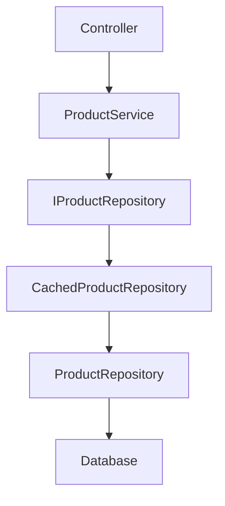
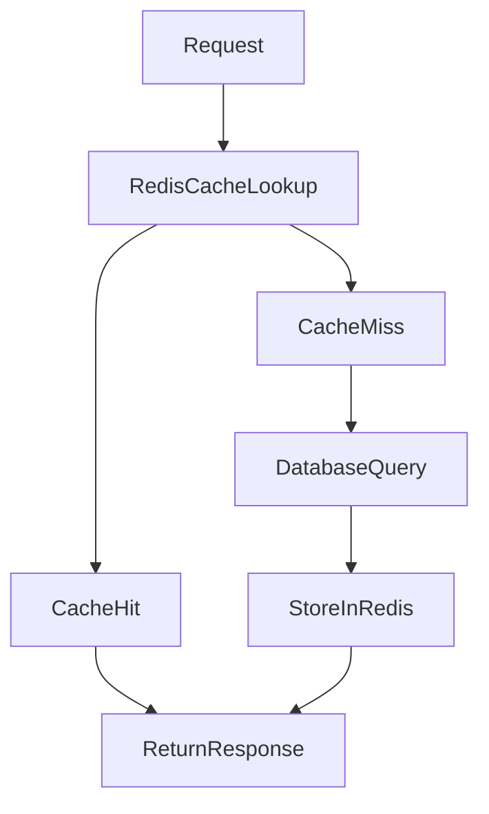
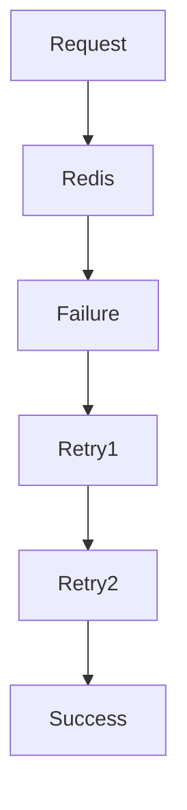

 ## 🚀 Decorator Pattern with Redis Caching in ASP.NET Core (.NET 8)

A sample ASP.NET Core Web API demonstrating:
Clean Architecture
Repository Pattern
Decorator Pattern
Polly Retry & Circuit Breaker
Dependency Injection

This project showcases how to add Redis caching without modifying repository logic by using the Decorator Pattern.

## 📐 Architecture



Redis is introduced through a caching decorator, keeping business logic clean and maintainable.

## 🎯 Design Patterns Used
### Repository Pattern

Encapsulates data access logic.

Decorator Pattern

Adds Redis caching behavior without changing repository implementation.

ProductRepository
        ↑
CachedProductRepository

Benefits:

Open/Closed Principle
Single Responsibility Principle
Easy to extend
Testable architecture

## ⚡ Redis Caching Flow


## 🛡 Polly Resilience Policies

The project uses Polly to handle transient Redis failures.

Implemented:

### Retry Policy
Attempt 1
   ↓
Retry
   ↓
Retry
   ↓
Success / Fail

### Circuit Breaker
Repeated Failures
      ↓
Circuit Opens
      ↓
Temporary Protection
      ↓
Automatic Recovery

Benefits:

Handles Redis connectivity issues
Protects downstream systems
Improves reliability

## 🏗 Solution Structure

```text
DecoratorPatternWithRedis
│
├── Application
│   ├── Interfaces
│   └── Services
│
├── Domain
│   ├── Entities
│   └── Interfaces
│
├── Infrastructure
│   ├── Caching
│   └── Repositories
│
└── API
    ├── Controllers
    ├── Program.cs
    └── appsettings.json


```


